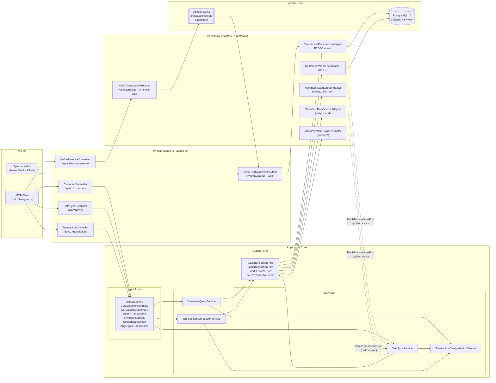

# Architecture

## High-Level Overview

The application follows a **Hexagonal Architecture** (Ports & Adapters) pattern built on Spring WebFlux (reactive) with R2DBC for non-blocking database access.

## Key Flows

| Flow | Path |
|---|---|
| Query customers / transactions | HTTP → Controller → UseCase → PersistenceAdapter → PostgreSQL |
| Sync from mock sources | HTTP → DataSyncController → DataSyncService → MockAdapters → SaveTransactionPort → PostgreSQL |
| Kafka ingestion | HTTP → KafkaGenerateController → Producer → Kafka → Consumer → PostgreSQL |

## Running Locally

| Mode | Command | Database | Kafka |
|---|---|---|---|
| Full stack (Docker) | `docker compose up --build` | PostgreSQL | Yes |
| Dev (no Docker) | `./mvnw spring-boot:run -Dspring-boot.run.profiles=dev` | H2 in-memory | No |

## API Entry Points

| Endpoint | Description |
|---|---|
| `GET  /api/v1/customers` | List all customers |
| `GET  /api/v1/customers/{id}/summary` | Financial summary for a customer |
| `GET  /api/v1/customers/{id}/transactions` | Filtered transaction list |
| `GET  /api/v1/customers/{id}/categories` | Category spend breakdown |
| `POST /api/v1/sync` | Trigger sync from mock data sources |
| `POST /api/v1/kafka/generate` | Publish synthetic transactions to Kafka |
| `GET  /swagger-ui.html` | Interactive API docs |
| `GET  /actuator/health` | Health check |
